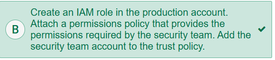
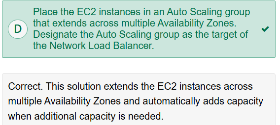

1. A company uses Amazon EC2 Reserved Instances to run its data processing workload. The nightly job 
typically takes 7 hours to run and must finish within a 10-hour time window. The company anticipates 
temporary increases in demand at the end of each month that will cause the job to run over the time limit 
with the capacity of the current resources. Once started, the processing job cannot be interrupted before 
completion. The company wants to implement a solution that would provide increased resource capacity 
as cost-effectively as possible. 

What should a solutions architect do to accomplish this? 
- A) Deploy On-Demand Instances during periods of high demand. 
- B) Create a second EC2 reservation for additional instances. 
- C) Deploy Spot Instances during periods of high demand. 
- D) Increase the EC2 instance size in the EC2 reservation to support the increased workload.

A – While Spot Instances would be the least costly option, they are not suitable for jobs that cannot be 
interrupted or must complete within a certain time period. On-Demand Instances would be billed for the number of 
seconds they are running. 

------------------------------------------------------------------------------------------------------------------------------

2. A company runs an online voting system for a weekly live television program. During broadcasts, 
users submit hundreds of thousands of votes within minutes to a front-end fleet of Amazon EC2 
instances that run in an Auto Scaling group. The EC2 instances write the votes to an Amazon RDS 
database. However, the database is unable to keep up with the requests that come from the EC2 
instances. A solutions architect must design a solution that processes the votes in the most efficient 
manner and without downtime. 
Which solution meets these requirements? 
- A) Migrate the front-end application to AWS Lambda. Use Amazon API Gateway to route user requests to 
the Lambda functions. 
- B) Scale the database horizontally by converting it to a Multi-AZ deployment. Configure the front-end 
application to write to both the primary and secondary DB instances. 
- C) Configure the front-end application to send votes to an Amazon Simple Queue Service (Amazon SQS) 
queue. Provision worker instances to read the SQS queue and write the vote information to the database. 
- D) Use Amazon EventBridge (Amazon CloudWatch Events) to create a scheduled event to re-provision the 
database with larger, memory optimized instances during voting periods. When voting ends, re-provision 
the database to use smaller instances. 

C – Decouple the ingestion of votes from the database to allow the voting system to continue processing votes 
without waiting for the database writes. Add dedicated workers to read from the SQS queue to allow votes to be 
entered into the database at a controllable rate. The votes will be added to the database as fast as the database 
can process them, but no votes will be lost.

------------------------------------------------------------------------------------------------------------------------------

3. A company has a two-tier application architecture that runs in public and private subnets. Amazon EC2 
instances running the web application are in the public subnet and an EC2 instance for the database runs 
on the private subnet. The web application instances and the database are running in a single Availability 
Zone (AZ). 
Which combination of steps should a solutions architect take to provide high availability for this 
architecture? (Select TWO.) 
- A) Create new public and private subnets in the same AZ. 
- B) Create an Amazon EC2 Auto Scaling group and Application Load Balancer spanning multiple AZs for the 
web application instances. 
- C) Add the existing web application instances to an Auto Scaling group behind an Application Load 
Balancer. 
- D) Create new public and private subnets in a new AZ. Create a database using an EC2 instance in the 
public subnet in the new AZ. Migrate the old database contents to the new database. 
- E) Create new public and private subnets in the same VPC, each in a new AZ. Create an Amazon RDS 
Multi-AZ DB instance in the private subnets. Migrate the old database contents to the new DB instance.

B, E – Create new subnets in a new Availability Zone (AZ) to provide a redundant network. Create an Auto 
Scaling group with instances in two AZs behind the load balancer to ensure high availability of the web application 
and redistribution of web traffic between the two public AZs. Create an RDS DB instance in the two private 
subnets to make the database tier highly available too. 

The correct answers are:  

### **Explanation:**  
To achieve **high availability (HA)**, the architecture must be resilient across **multiple Availability Zones (AZs)**. Here’s why these options are correct:  

1. **Option B (Auto Scaling + Load Balancer for Web Tier)**  
   - **Auto Scaling** ensures the web application can scale out/in based on demand.  
   - **Application Load Balancer (ALB)** distributes traffic across instances in **multiple AZs**, improving fault tolerance.  
   - This ensures the web tier remains available even if one AZ fails.  

2. **Option E (Multi-AZ RDS for Database Tier)**  
   - **Amazon RDS Multi-AZ** provides automatic failover to a standby database in a **different AZ** if the primary fails.  
   - Moving from a **single EC2-based database** (in a private subnet) to **RDS Multi-AZ** is a best practice for HA.  
   - New subnets in a **new AZ** ensure the database is distributed across AZs.  

### **Why Not the Other Options?**  
- **A) Same AZ subnets** → Does **not** improve HA (still single point of failure).  
- **C) Adding existing instances to ASG/ALB** → Doesn’t address **multi-AZ redundancy** (they’re still in one AZ).  
- **D) New database in a public subnet** → **Security risk!** Databases should **never** be in public subnets.  

### **Summary:**  
- **Web Tier:** Auto Scaling + ALB across AZs (B).  
- **Database Tier:** Migrate to **RDS Multi-AZ** in private subnets (E).  

------------------------------------------------------------------------------------------------------------------------------

4. A website runs a custom web application that receives a burst of traffic each day at noon. The users 
upload new pictures and content daily, but have been complaining of timeouts. The architecture uses 
Amazon EC2 Auto Scaling groups, and the application consistently takes 1 minute to initiate upon boot 
up before responding to user requests. 
How should a solutions architect redesign the architecture to better respond to changing traffic? 
- A) Configure a Network Load Balancer with a slow start configuration. 
- B) Configure Amazon ElastiCache for Redis to offload direct requests from the EC2 instances. 
- C) Configure an Auto Scaling step scaling policy with an EC2 instance warmup condition. 
- D) Configure Amazon CloudFront to use an Application Load Balancer as the origin. 

C – The current configuration puts new EC2 instances into service before they are able to respond to 
transactions. This could also cause the instances to overscale. With a step scaling policy, you can specify the 
number of seconds that it takes for a newly launched instance to warm up. Until its specified warm-up time has 
expired, an EC2 instance is not counted toward the aggregated metrics of the Auto Scaling group. While scaling 
out, the Auto Scaling logic does not consider EC2 instances that are warming up as part of the current capacity of 
the Auto Scaling group. Therefore, multiple alarm breaches that fall in the range of the same step adjustment 
result in a single scaling activity. This ensures that you do not add more instances than you need. 

The best answer is:

**C) Configure an Auto Scaling step scaling policy with an EC2 instance warmup condition.**

### Detailed Explanation:

1. **Core Problem Identification**:
   - The application experiences daily traffic bursts at noon
   - Current pain point: 1-minute warmup time for new instances causes timeouts
   - Need: Better handling of scaling to accommodate traffic bursts

2. **Why Option C is Correct**:
   - **Step Scaling Policy**: Allows for more aggressive scaling when traffic patterns are predictable (like daily bursts)
   - **Warmup Condition**: Accounts for the 1-minute initialization time, preventing new instances from receiving traffic until they're ready
   - This combination ensures:
     * Faster response to predictable traffic spikes
     * Proper handling of instance warmup period
     * Better user experience by reducing timeouts

3. **Why Other Options Are Less Suitable**:
   - **A) Network Load Balancer with slow start**: Wrong solution - NLB doesn't solve the warmup issue and isn't optimal for web traffic
   - **B) ElastiCache**: While helpful for performance, doesn't address the scaling/warmup challenge
   - **D) CloudFront**: Caching solution that doesn't solve the core scaling/warmup problem

4. **Additional Recommendations**:
   - Consider implementing scheduled scaling actions to proactively add capacity before noon
   - Evaluate application initialization to potentially reduce the 1-minute warmup time
   - Implement health checks to ensure only fully initialized instances receive traffic

This solution directly addresses the scaling challenges while accounting for the application's warmup requirements during traffic bursts.

------------------------------------------------------------------------------------------------------------------------------

5.  An application running on AWS uses an Amazon Aurora Multi-AZ DB cluster deployment for its 
database. When evaluating performance metrics, a solutions architect discovered that the database reads 
are causing high I/O and adding latency to the write requests against the database. 
What should the solutions architect do to separate the read requests from the write requests? 
- A) Enable read-through caching on the Aurora database. 
- B) Update the application to read from the Multi-AZ standby instance. 
- C) Create an Aurora replica and modify the application to use the appropriate endpoints. 
- D) Create a second Aurora database and link it to the primary database as a read replica.

C – Aurora Replicas provide a way to offload read traffic. Aurora Replicas share the same underlying storage 
as the main database, so lag time is generally very low. Aurora Replicas have their own endpoints, so the 
application will need to be configured to direct read traffic to the new endpoints. 

------------------------------------------------------------------------------------------------------------------------------

6. A company runs a public-facing three-tier web application in a VPC across multiple Availability Zones. 
Amazon EC2 instances for the application tier running in private subnets need to download software 
patches from the internet. However, the EC2 instances cannot be directly accessible from the internet.  
Which actions should be taken to allow the EC2 instances to download the needed patches? (Select 
TWO.) 
- A) Configure a NAT gateway in a public subnet.  
- B) Define a custom route table with a route to the NAT gateway for internet traffic and associate it with the 
private subnets for the application tier.  
- C) Assign Elastic IP addresses to the EC2 instances. 
- D) Define a custom route table with a route to the internet gateway for internet traffic and associate it with 
the private subnets for the application tier.  
- E) Configure a NAT instance in a private subnet.

A, B – A NAT gateway forwards traffic from the EC2 instances in the private subnet to the internet or other 
AWS services, and then sends the response back to the instances. After a NAT gateway is created, the route 
tables for private subnets must be updated to point internet traffic to the NAT gateway.

The correct answers are:  

### **A) Configure a NAT gateway in a public subnet.**  
### **B) Define a custom route table with a route to the NAT gateway for internet traffic and associate it with the private subnets for the application tier.**  

### **Explanation:**  
Since the EC2 instances are in **private subnets** and cannot be directly exposed to the internet, they need a **NAT (Network Address Translation) gateway** to access the internet for downloading patches. Here’s how it works:  

1. **NAT Gateway (Option A)**  
   - A **NAT gateway** must be deployed in a **public subnet** (since it needs internet access via an Internet Gateway).  
   - It allows instances in private subnets to initiate outbound connections to the internet while blocking inbound traffic.  

2. **Route Table Configuration (Option B)**  
   - A **custom route table** must be created for the private subnets.  
   - The route table should direct **outbound internet traffic (0.0.0.0/0)** to the **NAT gateway**.  
   - This route table must be **associated with the private subnets** where the EC2 instances reside.  

### **Why Not the Other Options?**  
- **C) Assign Elastic IP addresses to the EC2 instances** → Private instances should **not** have public IPs.  
- **D) Route to an Internet Gateway (IGW)** → IGWs only work for public subnets, not private ones.  
- **E) Configure a NAT instance in a private subnet** → NAT instances should be in a **public subnet** (like NAT gateways).  

### **Summary:**  
- **NAT Gateway (Public Subnet) + Route Table (Private Subnet)** is the correct approach.  
- This ensures secure outbound internet access without exposing private instances.  

------------------------------------------------------------------------------------------------------------------------------

7. A solutions architect wants to design a solution to save costs for Amazon EC2 instances that do not 
need to run during a 2-week company shutdown. The applications running on the EC2 instances store 
data in instance memory that must be present when the instances resume operation. 
Which approach should the solutions architect recommend to shut down and resume the EC2 instances? 
- A) Modify the application to store the data on instance store volumes. Reattach the volumes while restarting 
them.  
- B) Snapshot the EC2 instances before stopping them. Restore the snapshot after restarting the instances.  
- C) Run the applications on EC2 instances enabled for hibernation. Hibernate the instances before the 2
week company shutdown.  
- D) Note the Availability Zone for each EC2 instance before stopping it. Restart the instances in the same 
Availability Zones after the 2-week company shutdown. 

C – Hibernating EC2 instances save the contents of instance memory to an Amazon Elastic Block Store 
(Amazon EBS) root volume. When the instances restart, the instance memory contents are reloaded. 

------------------------------------------------------------------------------------------------------------------------------

8. A company plans to run a monitoring application on an Amazon EC2 instance in a VPC. Connections 
are made to the EC2 instance using the instance’s private IPv4 address. A solutions architect needs to 
design a solution that will allow traffic to be quickly directed to a standby EC2 instance if the application 
fails and becomes unreachable. 
Which approach will meet these requirements? 
- A) Deploy an Application Load Balancer configured with a listener for the private IP address and register the 
primary EC2 instance with the load balancer. Upon failure, de-register the instance and register the 
standby EC2 instance.  
- B) Configure a custom DHCP option set. Configure DHCP to assign the same private IP address to the 
standby EC2 instance when the primary EC2 instance fails. 
- C) Attach a secondary elastic network interface to the EC2 instance configured with the private IP address. 
Move the network interface to the standby EC2 instance if the primary EC2 instance becomes 
unreachable.  
- D) Associate an Elastic IP address with the network interface of the primary EC2 instance. Disassociate the 
Elastic IP from the primary instance upon failure and associate it with a standby EC2 instance. 

 C – A secondary elastic network interface can be added to an EC2 instance. While primary network interfaces 
cannot be detached from an instance, secondary network interfaces can be detached and attached to a different 
EC2 instance. 

The correct answer is:

**C) Attach a secondary elastic network interface to the EC2 instance configured with the private IP address. Move the network interface to the standby EC2 instance if the primary EC2 instance becomes unreachable.**

Here's the detailed explanation:

1. **Key Requirements**:
   - Need to maintain the same private IP address for failover
   - Quick redirection of traffic to standby instance
   - Solution must work with private IP addressing within VPC

2. **Why Option C is Best**:
   - Elastic Network Interface (ENI) can be pre-configured with the desired private IP
   - ENI can be detached from failed instance and attached to standby instance
   - This provides the fastest failover while maintaining the same private IP
   - No DNS propagation delays or changes to routing tables needed
   - Maintains all existing connections using the same private IP

3. **Why Other Options Are Inferior**:
   - **A) Application Load Balancer**:
     * Requires changing client configuration to use ALB DNS name instead of private IP
     * Adds complexity with registration/deregistration process
     * Not as quick as ENI failover

   - **B) Custom DHCP option set**:
     * DHCP doesn't work this way in AWS VPC
     * IP addresses are tied to ENIs, not assigned via DHCP in this manner
     * Would require instance reboot to get new IP

   - **D) Elastic IP address**:
     * Doesn't solve the private IP requirement
     * Elastic IPs are public addresses, not private
     * Would require NAT configuration changes

4. **Implementation Considerations**:
   - Use AWS Lambda and CloudWatch Alarms to automate the ENI failover
   - Ensure standby instance is pre-configured to accept the ENI
   - Test failover procedure to validate recovery time objectives

This solution provides the most direct and efficient way to meet the requirement of maintaining the same private IP address while enabling quick failover to a standby instance.

------------------------------------------------------------------------------------------------------------------------------

9. An analytics company is planning to offer a web analytics service to its users. The service will require 
that the users’ webpages include a JavaScript script that makes authenticated GET requests to the 
company’s Amazon S3 bucket.  
What must a solutions architect do to ensure that the script will successfully execute? 
- A) Enable cross-origin resource sharing (CORS) on the S3 bucket. 
- B) Enable S3 Versioning on the S3 bucket. 
- C) Provide the users with a signed URL for the script. 
- D) Configure an S3 bucket policy to allow public execute privileges.

A – Web browsers will block running a script that originates from a server with a domain name that is different 
from the webpage. Amazon S3 can be configured with CORS to send HTTP headers that allow the script to run.  

------------------------------------------------------------------------------------------------------------------------------

10. A company’s security team requires that all data stored in the cloud be encrypted at rest at all times 
using encryption keys stored on premises. 
Which encryption options meet these requirements? (Select TWO.) 
- A) Use server-side encryption with Amazon S3 managed encryption keys (SSE-S3).  
- B) Use server-side encryption with AWS KMS managed encryption keys (SSE-KMS). 
- C) Use server-side encryption with customer-provided encryption keys (SSE-C). 
- D) Use client-side encryption to provide at-rest encryption. 
- E) Use an AWS Lambda function invoked by Amazon S3 events to encrypt the data using the customer’s 
keys. 

C, D – Server-side encryption with customer-provided keys (SSE-C) enables Amazon S3 to encrypt objects on 
the server side using an encryption key provided in the PUT request. The same key must be provided in the GET 
requests for Amazon S3 to decrypt the object. Customers also have the option to encrypt data on the client side 
before uploading it to Amazon S3, and then they can decrypt the data after downloading it. AWS software 
development kits (SDKs) provide an S3 encryption client that streamlines the process. 

### Detailed Explanation:

1. **Key Requirement**: 
   - Data must be encrypted at rest using keys stored on-premises (not in AWS)

2. **Option C (SSE-C)**:
   - Allows customers to provide their own encryption keys during S3 upload requests
   - AWS uses these customer-supplied keys to encrypt the data at rest
   - AWS does not store the encryption keys - they must be provided with each request
   - Meets the requirement of keeping keys on-premises

3. **Option D (Client-side Encryption)**:
   - Data is encrypted by the client application before being uploaded to AWS
   - Encryption keys never leave customer control (remain on-premises)
   - Provides end-to-end encryption with full customer key control
   - AWS only sees/stores the already-encrypted data

4. **Why Other Options Don't Meet Requirements**:
   - **A) SSE-S3**: Uses AWS-managed keys (not customer on-premises keys)
   - **B) SSE-KMS**: Uses AWS KMS-managed keys (though customer-managed CMK is possible, keys are still in AWS)
   - **E) Lambda encryption**: Would still result in unencrypted data being temporarily stored in S3 before encryption

5. **Implementation Considerations**:
   - SSE-C requires sending keys with each request (operational overhead)
   - Client-side encryption provides strongest security but requires more application changes
   - Both options require careful key management on-premises
   - Consider using AWS Storage Gateway for hybrid scenarios

These two options are the only ones that fully meet the requirement of using encryption keys stored exclusively on-premises while ensuring data is encrypted at rest in AWS.

------------------------------------------------------------------------------------------------------------------------------

11. A company is deploying a new database on a new Amazon EC2 instance. The workload of this database requires a single Amazon Elastic Block Store (Amazon EBS) volume that can support up to 20,000 IOPS.

Which type of EBS volume meets this requirement?

A Provisioned IOPS SSD EBS volume provides up to 64,000 IOPS for each volume.

------------------------------------------------------------------------------------------------------------------------------

12. A company is transitioning its Amazon EC2 based MariaDB database to Amazon RDS. The company has already identified a database instance type that will meet the company's CPU and memory requirements. The database must provide at least 40 GiB of storage capacity and 1,000 IOPS.

Which storage configuration for the Amazon RDS for MariaDB instance is MOST cost-effective?

Correct. General Purpose SSD (gp3) includes 3,000 IOPS at no additional cost independent of volume size.

------------------------------------------------------------------------------------------------------------------------------

13. A company is developing a chat application that will be deployed on AWS. The application stores the messages by using a key-value data model. Groups of users typically read the messages multiple times. A solutions architect must select a database solution that will scale for a high rate of reads and will deliver messages with microsecond latency.

Which database solution will meet these requirements?

DynamoDB is a NoSQL database that supports key-value records. DAX delivers response times in microseconds.

------------------------------------------------------------------------------------------------------------------------------

14. A company is deploying a new application that will consist of an application layer and an online transaction processing (OLTP) relational database. The application must be available at all times. However, the application will have unpredictable traffic patterns. The company wants to pay the minimum for compute costs during these idle periods.

Which solution will meet these requirements MOST cost effectively?

When Amazon ECS uses Fargate for compute, it incurs minimal costs when the application is idle. Aurora Serverless also incurs no compute costs when it is idle.

------------------------------------------------------------------------------------------------------------------------------

15. A company is designing a disaster recovery (DR) architecture for an important application on AWS. The company has determined that the recovery time objective (RTO) is 5 minutes with a minimal running instance capacity to support the application in the AWS DR site. The company needs to minimize costs for the DR architecture.

Which DR strategy will meet these requirements?

Warm standby. This solution meets the requirement for an RTO of 5 minutes with a minimal running instance. The instances run at a low capacity and can scale within minutes.

------------------------------------------------------------------------------------------------------------------------------

16. A company is investigating services to manage vulnerability scans in Amazon EC2 instances and container images that the company stores in Amazon Elastic Container Registry (Amazon ECR). The service should identify potential software vulnerabilities and categorize the severity of the vulnerabilities.

Which AWS service will meet these requirements?

Amazon Inspector. Amazon Inspector removes the operational overhead that is necessary to configure a vulnerability management solution. Amazon Inspector works with both EC2 instances and container images in Amazon ECR to identify potential software vulnerabilities and to categorize the severity of the vulnerabilities.

------------------------------------------------------------------------------------------------------------------------------

17. A company has strict data protection requirements. A solutions architect must configure security for a VPC to ensure that backend Amazon RDS DB instances cannot be accessed from the internet. The solutions architect must ensure that the DB instances are accessible from the application tier over a specified port only.

Which actions should the solutions architect take to meet these requirements? (Select TWO.)

A private subnet is one component to use to secure the database tier. Internet traffic is not routed to a private subnet. When you place DB instances in a private subnet, you add a layer of security.

Security groups can restrict access to the DB instances. Security groups provide access from only the application tier on only a specific port.

------------------------------------------------------------------------------------------------------------------------------

18. A company has an on-premises application that exports log files about users of a website. The log files range from 20 GB to 30 GB in size. A solutions architect has created an Amazon S3 bucket to store the files. The files will be uploaded directly from the application. The network connection experiences intermittent failures, and the upload sometimes fails. The solutions architect must design a solution that resolves this issue. The solution must minimize operational overhead.

Which solution will meet these requirements?

You can use a multipart upload to upload larger files, such as the files in this scenario. If transmission of any part fails, you can retransmit that part without affecting other parts.

------------------------------------------------------------------------------------------------------------------------------

19. A company needs to look up configuration details about how a Linux-based Amazon EC2 instance was launched.

Which command should a solutions architect run on the EC2 instance to gather the system metadata?

The only way to retrieve instance metadata is to use the link-local address, which is 169.254.169.254.

------------------------------------------------------------------------------------------------------------------------------

20. A company is developing a new mobile version of its popular web application in the AWS Cloud. The mobile app must be accessible to internal and external users. The mobile app must handle authorization, authentication, and user management from one central source.

Which solution meets these requirements?

Amazon Cognito User Pools.

Amazon Cognito provides authentication, authorization, and user management for your web and mobile apps. Users can sign in directly with a user name and password, or through a trusted third party.

------------------------------------------------------------------------------------------------------------------------------

21. A company has an application that runs on a large general purpose Amazon EC2 instance type that is part of an EC2 Auto Scaling group. The company wants to reduce future costs associated with this application. After the company reviews metrics and logs in Amazon CloudWatch, the company notices that this application runs randomly a couple of times a day to retrieve and manage data. According to CloudWatch, the maximum runtime for each request is 10 minutes, the memory use is 4 GB, and the instances are always in the running state.

Which solution will reduce costs the MOST?

Lambda is a fully managed service that would automatically scale when necessary and would be highly available. A solution that deploys the application as a Lambda function reduces costs the most.

------------------------------------------------------------------------------------------------------------------------------

22. Which components are required to build a site-to-site VPN connection to AWS? (Select TWO.)

A customer gateway is required for the VPN connection to be established. A customer gateway device is set up and configured in the customer's data center.

A virtual private gateway is attached to a VPC to create a site-to-site VPN connection to AWS. You can accept private encrypted network traffic from an on-premises data center into your VPC without the need to traverse the open public internet.

------------------------------------------------------------------------------------------------------------------------------

23. A company needs to maintain data records for a minimum of 5 years. The data is rarely accessed after it is stored. The data must be accessible within 2 hours.

Which solution will meet these requirements MOST cost-effectively?

The storage of the data in an S3 bucket provides a cost-effective initial location for the data. S3 Glacier Instant Retrieval is the most cost-effective archival storage solution that meets the requirement of a 2-hour retrieval time.

------------------------------------------------------------------------------------------------------------------------------

24. A media company is designing a new application for graphic rendering. The application requires up to 400 GB of storage for temporary data that is discarded after the frames are rendered. The application requires approximately 40,000 random IOPS to perform the rendering.

What is the MOST cost-effective storage option for this rendering application?

Storage optimized instances are designed for workloads that require high, sequential read and write access to very large datasets on local storage. These instances are optimized to provide applications with tens of thousands of low-latency, random IOPS. The instance store has no additional cost.

25. A reporting application runs on Amazon EC2 instances behind an Application Load Balancer. The instances run in an Amazon EC2 Auto Scaling group across multiple Availability Zones. For complex reports, the application can take up to 15 minutes to respond to a request. A solutions architect is concerned that users will receive HTTP 5xx errors if a report request is in process during a scale-in event.

What should the solutions architect do to ensure that user requests will be completed before instances are terminated?

y default, the Application Load Balancer waits 300 seconds before the completion of the deregistration process, which can help in-flight requests to the target become complete. To change the amount of time that the Application Load Balancer waits, update the deregistration delay value.

26. A company runs its website on Amazon EC2 instances behind an Application Load Balancer that is configured as the origin for an Amazon CloudFront distribution. The company wants to protect against cross-site scripting and SQL injection attacks.

Which approach should a solutions architect recommend to meet these requirements?

AWS WAF can detect the presence of SQL code that is likely to be malicious (known as SQL injection). AWS WAF also can detect the presence of a script that is likely to be malicious (known as cross-site scripting).

27. A company asks a solutions architect to implement a pilot light disaster recovery (DR) strategy for an existing on-premises application. The application is self contained and does not need to access any databases.

Which solution will implement a pilot light DR strategy?

This is a pilot light DR strategy. This solution recreates an existing application hosting environment in an AWS Region. This solution turns off most (or all) resources and uses the resources only during tests or when DR failover is necessary. RPO and RTO are usually 10s of minutes.

28. A company that processes satellite images has an application that runs on AWS. The company stores the images in an Amazon S3 bucket. For compliance reasons, the company must replicate all data once a month to an on-premises location. The average amount of data that the company needs to transfer is 60 TB.

What is the MOST cost-effective way to transfer this data?

The base price covers the device and 10 days of usage at the on-premises location. If the company returns the device within a week, the company pays the base price and the price for data transfer out of AWS.

29. A company uses one AWS account to run production workloads. The company has a separate AWS account for its security team. During periodic audits, the security team needs to view specific account settings and resource configurations in the AWS account that runs production workloads. A solutions architect must provide the required access to the security team by designing a solution that follows AWS security best practices.

Which solution will meet these requirements?

This solution follows security best practices by using a role to delegate permissions that consist of least-privilege access

30. An application runs on two Amazon EC2 instances behind a Network Load Balancer. The EC2 instances are in a single Availability Zone.

What should a solutions architect do to make this architecture more highly available?

